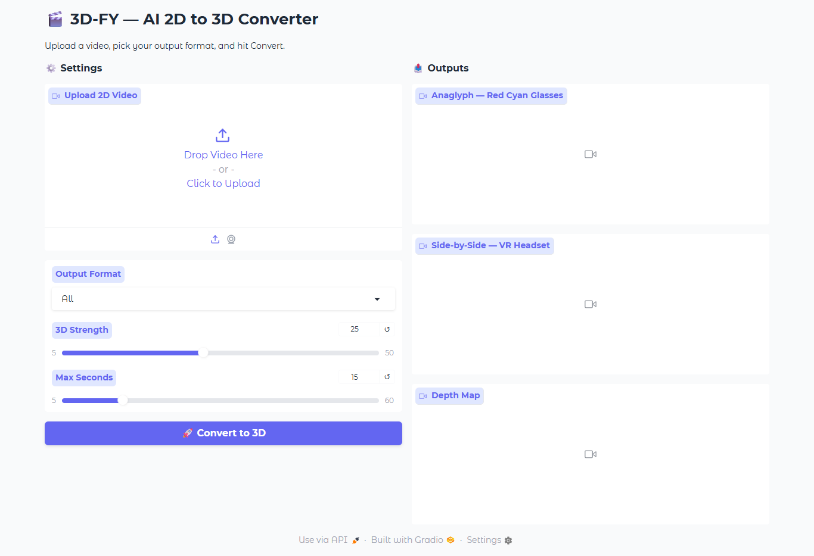

# 🎬 3D-FY — AI-Powered 2D to 3D Video Converter
Convert any standard 2D video into immersive 3D formats using monocular depth estimation. Outputs are ready for Red-Cyan glasses, VR headsets and 3D visualization — all running on a free Kaggle GPU.

-----
# Sample Output
| ![original]
(assets/original.gif). | 

-----------------------
  ## How It Works
Input Video → Frame Extraction → MiDaS Depth Estimation → Pixel Shifting → Stereoscopic Synthesis → Output Video

1. Each frame is passed through **MiDaS DPT-Hybrid**, a transformer-based 
   monocular depth estimation model by Intel ISL
2. The depth map is used to horizontally shift pixels — close objects shift 
   more, far objects shift less — simulating the parallax seen by human eyes
3. Left and right eye views are composited into Anaglyph or SBS format
4. Temporal smoothing via exponential moving average reduces depth 
   flickering between frames
5. Original audio is preserved using ffmpeg
-------------------------
## 🖥️ Interface

The project includes a Gradio web interface that runs on Kaggle GPU and generates
a public link accessible from any device — no local GPU needed.

--------------------------
## Tech Stack

| Tool | Purpose |
|---|---|
| MiDaS DPT-Hybrid | Monocular depth estimation |
| PyTorch | Model inference |
| OpenCV | Frame read/write, color mapping |
| NumPy | Vectorized pixel shifting |
| Gradio | Interactive web interface |
| ffmpeg | Audio preservation |
| Kaggle T4 GPU | Free compute |

---------------------------
## Run It Yourself

This project is designed to run on **Kaggle Notebooks** with a free T4 GPU.

1. Go to [kaggle.com](https://kaggle.com) and create a free account
2. Create a new notebook and enable GPU: 
   `Settings → Accelerator → GPU T4`
3. Upload your video using `Add Data → Upload`
4. Copy each cell from the notebook in order and run them sequentially
5. For manual mode: set `VIDEO_PATH` and run the processing cell
6. Download outputs from `/kaggle/working/output/`
7. For interface mode: run the Gradio cell, open the public link printed in output
---------------------------
## 📤 Output Formats

|    Format    |           View With                  |      Use Case           |
|--------------|--------------------------------------|-------------------------|
|   Anaglyph   |       Red-Cyan 3D glasses            | Cinema, presentations   |
| Side-by-Side | VR headset (Meta Quest, Cardboard)   | Immersive VR viewing    |
|   Depth Map  |          Any player                  | Visualization, debugging|

-----------------------------

## Limitations and Future Scope

- Depth estimation is relative, not metric — transparent surfaces and 
  fast motion create artifacts
- Occlusion hole filling using depth-guided inpainting is under active 
  development 
- Temporal consistency currently uses EMA smoothing — proper video-aware 
  depth models are identified as future work
- Real-time inference requires model optimization (TensorRT, ONNX export)

-----------------------------
## Author

**Mohit Aditya**  
B.Tech Artificial Intelligence and Machine Learning  
JB Institute of Technology, Dehradun  
[LinkedIn](https://linkedin.com/in/yourprofile) · 
[GitHub](https://github.com/yourusername)

-----------------------------

## Acknowledgements

- [MiDaS](https://github.com/isl-org/MiDaS) by Intel ISL for the depth 
  estimation model
- [StereoCrafter](https://github.com/TencentARC/StereoCrafter) paper for 
  establishing the problem benchmark
- Kaggle for free GPU compute

